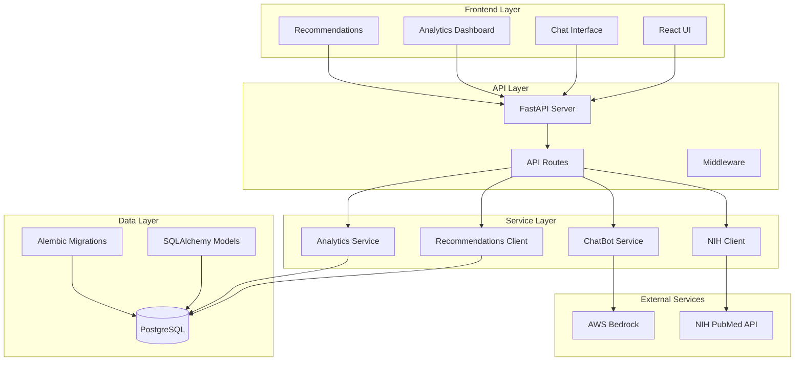

# 🌙 Sleep Science Explainer Bot

A conversational AI assistant that helps users understand sleep science research and provides evidence-based sleep recommendations.

## 🎯 Project Overview

This full-stack application combines:
- **FastAPI Backend**: RESTful API with AI-powered chat interface
- **React Frontend**: Modern, responsive user interface
- **PostgreSQL Database**: Reliable data storage and analytics
- **AWS Bedrock**: Advanced AI capabilities for sleep science explanations
- **Analytics Dashboard**: Real-time usage monitoring and insights

## 🚀 Quick Start

### Prerequisites
- Python 3.9+
- Node.js 18+
- PostgreSQL database
- AWS Account with Bedrock access

### Installation

1. **Clone the repository**
```bash
git clone https://github.com/breese5/Sleep-Science-Project
cd SleepScience
```

2. **Set up backend**
```bash
python -m venv venv
source venv/bin/activate  # On Windows: venv\Scripts\activate
pip install -r requirements.txt
```

3. **Set up frontend**
```bash
cd frontend
npm install
cd ..
```

4. **Configure environment**
```bash
cp env.example .env
# Edit .env with your database and AWS credentials
```

5. **Start the application**
```bash
python main.py both
```

The application will be available at:
- **Frontend**: http://localhost:3000
- **Backend API**: http://localhost:8000


## 🏗️ System Architecture



## 🎯 Core Features

### 🤖 AI-Powered Chat Interface
- **Sleep Science Explanations**: Get clear, evidence-based explanations of sleep research
- **Research Paper Summaries**: Understand complex scientific papers in simple terms
- **Personalized Responses**: Context-aware conversations about sleep topics
- **Source Attribution**: Proper citations and references for all information

### 📊 Analytics Dashboard
- **Real-time Monitoring**: Track system usage and performance
- **User Engagement**: Monitor chat interactions and topic popularity
- **System Health**: Monitor application status and error rates
- **Usage Trends**: Analyze patterns over time

### 💡 Sleep Recommendations
- **Evidence-Based Advice**: Recommendations backed by scientific research
- **Categorized Content**: Organized by sleep topics and conditions
- **Expert Curation**: Content reviewed by sleep science experts
- **Personalized Suggestions**: Tailored recommendations based on user interests

### 🔍 Research Paper Search
- **PubMed Integration**: Access to millions of sleep science papers
- **Smart Summaries**: AI-generated summaries of complex research
- **Relevance Filtering**: Find papers most relevant to your questions
- **Citation Management**: Proper academic citations and references

## 📊 Analytics Dashboard Guide

### Accessing the Dashboard
The analytics dashboard is available at: `http://localhost:8000/api/v1/monitoring/dashboard`

### Key Metrics

#### System Performance
- **Response Time**: Average API response times
- **Error Rate**: Percentage of failed requests
- **Active Users**: Current user sessions
- **Database Health**: Connection status and performance

#### User Engagement
- **Total Conversations**: Number of chat sessions
- **Messages Sent**: Total user messages
- **Popular Topics**: Most discussed sleep topics
- **Session Duration**: Average conversation length

#### Content Analytics
- **Recommendations Viewed**: Most accessed sleep advice
- **Papers Searched**: Popular research topics
- **AI Response Quality**: User satisfaction metrics
- **Feature Usage**: Which features are most popular

### Data Export
Export analytics data in various formats:
```bash
# JSON format
curl "http://localhost:8000/api/v1/analytics/export?format=json&days=30"

# CSV format  
curl "http://localhost:8000/api/v1/analytics/export?format=csv&days=7"
```

### Troubleshooting Analytics

#### Common Issues
- **No data showing**: Check if the application is running and users are active
- **Missing metrics**: Verify database connectivity and logging configuration
- **Stale data**: Ensure the dashboard is refreshing properly

#### Data Accuracy
- Analytics are based on actual user interactions
- Metrics update in real-time as users engage with the system
- Historical data is preserved for trend analysis

---

## 📄 API Documentation

### Core Endpoints

#### Chat Interface
- `POST /api/v1/chat` - Send message to AI assistant
- `GET /api/v1/chat/conversation/{id}` - Get conversation history
- `DELETE /api/v1/chat/conversation/{id}` - Delete conversation
- `GET /api/v1/chat/topics` - Get available topics

#### Research Papers
- `GET /api/v1/papers/search` - Search PubMed papers
- `GET /api/v1/papers/{id}` - Get paper details
- `GET /api/v1/papers/recent` - Get recent papers
- `POST /api/v1/papers/summarize` - Generate paper summary

#### Recommendations
- `GET /api/v1/recommendations` - Get sleep recommendations
- `GET /api/v1/recommendations/{id}` - Get specific recommendation
- `GET /api/v1/recommendations/categories` - Get categories

#### Analytics
- `GET /api/v1/analytics/overview` - Get analytics overview
- `GET /api/v1/analytics/topics` - Get topic analytics
- `GET /api/v1/analytics/users/{id}` - Get user analytics
- `GET /api/v1/analytics/trends` - Get usage trends

#### Health & Monitoring
- `GET /api/v1/health` - Basic health check
- `GET /api/v1/health/detailed` - Detailed health status
- `GET /api/v1/ready` - Readiness check

#### Monitoring Dashboard
- `GET /api/v1/monitoring/dashboard` - HTML monitoring dashboard
- `GET /api/v1/monitoring/metrics` - System performance metrics
- `GET /api/v1/monitoring/logs` - Recent application logs

### Interactive API Docs
- **Swagger UI**: http://localhost:8000/docs
- **ReDoc**: http://localhost:8000/redoc

## 🗄️ Database Schema

### Core Tables
- **users**: User information and session data
- **conversations**: Chat session management
- **messages**: Individual chat messages
- **interactions**: Analytics tracking
- **research_papers**: Cached paper data
- **sleep_recommendations**: Expert recommendations
- **analytics_metrics**: Aggregated analytics

## 🔒 Security & Privacy

### Data Protection
- **User Anonymization**: No personal data collection
- **Secure API Endpoints**: Rate limiting and validation
- **Environment Variables**: Secure credential management
- **Input Validation**: Sanitized user inputs

### Responsible AI
- **Medical Disclaimer**: Educational purposes only
- **Source Attribution**: Proper citation of sources
- **Bias Mitigation**: Diverse expert perspectives
- **Content Filtering**: Safe and appropriate responses

## 🧪 Testing

### Test Suite Overview
The project includes a comprehensive test suite that validates core API functionality:

- **Health Check Tests**: Verify application status endpoints
- **Recommendations Tests**: Validate sleep recommendation data structure
- **Chat Interface Tests**: Test basic chat functionality (with graceful AWS/DB failure handling)
- **Analytics Tests**: Ensure analytics endpoints return proper data structure

### Running Tests

#### Prerequisites
```bash
# Install test dependencies
pip install pytest pytest-cov
```

#### Basic Test Execution
```bash
# Run all tests
pytest tests/

# Run with verbose output
pytest tests/ -v

# Run specific test file
pytest tests/test_api.py

# Run specific test function
pytest tests/test_api.py::test_health_check
```

#### Test Coverage
```bash
# Generate coverage report
pytest --cov=backend --cov-report=html tests/

# Generate coverage report with terminal output
pytest --cov=backend --cov-report=term-missing tests/

# Generate multiple report formats
pytest --cov=backend --cov-report=html --cov-report=term --cov-report=xml tests/
```

### Coverage Report
After running tests with coverage, you can view the detailed coverage report:

1. **HTML Report**: Open `htmlcov/index.html` in your web browser
   - Interactive coverage visualization
   - Line-by-line coverage analysis
   - File and directory coverage breakdown
   - Missing coverage highlighting

2. **Terminal Report**: Coverage summary displayed in terminal output
   - Overall coverage percentage
   - Missing lines summary
   - File-by-file coverage

### Test Structure
```
tests/
└── test_api.py              # API endpoint tests
    ├── test_health_check()           # Health endpoint validation
    ├── test_get_recommendations()    # Recommendations data structure
    ├── test_chat_endpoint_basic()    # Chat functionality (basic)
    └── test_analytics_endpoint()     # Analytics data structure
```

### Test Features
- **Isolated Testing**: Each test runs independently
- **Graceful Failure Handling**: Tests handle expected AWS/DB issues
- **Data Structure Validation**: Ensures API responses have correct format
- **Error State Testing**: Validates proper error handling
- **Coverage Tracking**: Monitors code coverage across backend modules

### Frontend Testing
```bash
cd frontend
npm test
npm run build
```

## 📄 License

This project is licensed under the MIT License - see the [LICENSE](LICENSE) file for details.

## ⚖️ Disclaimer

This is not meant to be medical advice and is made for educational purposes only. Consult with a doctor for further questions.

## 🆘 Support

### Documentation
- [Setup Guide](SETUP.md) - Detailed installation instructions
- [API Documentation](http://localhost:8000/docs) - Interactive API docs
- [Project Plan](sleep_science_plan.md) - Original project specifications

### Troubleshooting
- Check the [SETUP.md](SETUP.md) troubleshooting section
- Review application logs for error messages
- Verify environment variables are correctly set
- Ensure all services (PostgreSQL, AWS) are accessible

---

**Built for better sleep science education**

## 🤖 AI Assistance

This project was developed with the assistance of **Cursor**, an AI pair programming tool, to accelerate development, debugging, and documentation.
